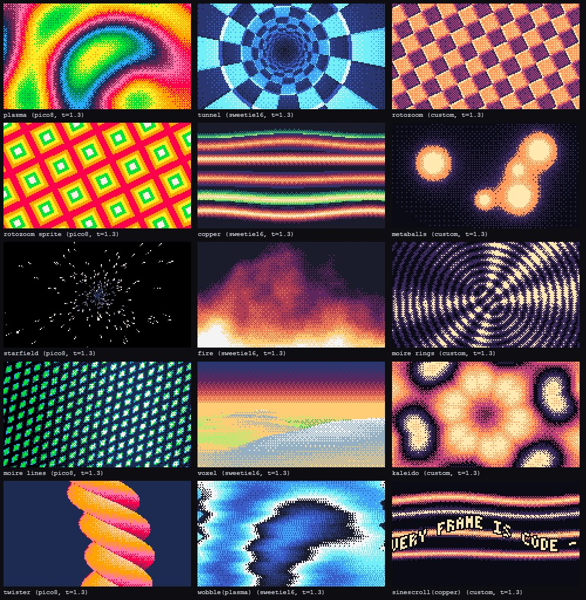

# Demoscene effects

In the 1990s the demoscene squeezed plasma, tunnels and fire out of machines with a few hundred kilobytes; today the same trick lives on as PICO-8 "tweetcarts" (a whole animation in 280 characters) and Pyxel demos. The idea: **a tiny formula per pixel, mapped through a palette ramp**. It happens to be exactly what this kit wants from a picture:

- **A pure function of `(x, y, t)`.** No buffers, no simulation, no state between frames. Seeking, `--draft` and parallel render workers just work ([00-agent-brief.md](00-agent-brief.md), rule 2).
- **Cheap.** At 160x90 or 320x180 a frame is 15-58 thousand pixels; every effect below costs 0.1-2.2 ms, so a 1080p film that upscales it renders as fast as one that draws nothing.
- **Palette-limited by construction.** Values become palette indices through a ramp and a Bayer threshold, so the picture is pixel art with real ordered dither, not a gradient with banding.
- **Rich for almost no code.** One idea per shot, a whole backdrop. Good for title cards, "computer" scenes, transitions and music-video energy; see the table below.

`runtime/pixel-fx.js` builds on the indexed screen of [15-pixel-retro.md](15-pixel-retro.md):

```html
<script src="../../runtime/pixel.js"></script>
<script src="../../runtime/pixel-fx.js"></script>
```



*`examples/pixel/stills/fx-sheet.jpg`: one frame of each effect. The palette rotates through pico8, sweetie16 and a 5-color custom palette (the caption names it); the effects pick their colors from whatever palette the screen has.*

## The API in one screen

```js
const scr = Pixel.screen({ w: 160, h: 90, palette: 'pico8' });
Pixel.fx.plasma(scr, t);                                       // fills the whole screen, returns scr
Pixel.fx.fire(scr, t, { ramp: 'fire', rise: 1.4 });            // options are all optional
Pixel.fx.tunnel(scr, t, { x: 0, y: 20, w: 160, h: 50 });       // only a rectangle of the screen
Pixel.fx.wobble(scr, t, { amp: 4, freq: 5 });                  // post effect on what is already there
Pixel.fx.sinescroll(scr, t, 'HELLO WORLD', { speed: 40 });     // overlay: text on a sine
```

`Pixel.fx.<name>(scr, t, opts)`: `t` is seconds; the result is a pure function of `t` and `opts`. Every effect **writes straight into `scr.px`**, so it ignores `camera`, `clip`, `pal` and `dither` (see Pitfalls); it returns `scr` so calls chain with the rest of the screen API.

**Shared options**

| Option | Default | Meaning |
|---|---|---|
| `x`, `y`, `w`, `h` | the whole screen | Region to fill: `x`, `y` is the top-left, `w`, `h` default to the screen edge. No other option uses these names |
| `ramp` | per effect | Which palette colors, dark to light: a name, a list of indices or a list of hex colors (next section) |
| `dither` | `'bayer4'` | `'none'` (hard steps), `'bayer4'`, `'bayer8'` (finer, softer) |
| `speed` | 1 | Multiplies `t` |
| `scale` | 1 | Spatial zoom: bigger means more detail per screen |
| `seed` | 0 | Shifts phases and reseeds the random parts (stars, noise) |
| `cyclic` | per effect | `true`: the value wraps around the ramp (plasma, kaleido); `false`: it clamps |

## Anatomy of an effect

Every effect does the same three things per pixel, and they are the whole trick:

```js
// 1. a value 0..1 from (x, y, t)         v = .5 + .5 * Math.sin(x * .1 + t) * Math.sin(y * .1)
// 2. add the Bayer threshold             f = v * (ramp.length - 1) + bayer(x & 3, y & 3)      // threshold 0..1, centered on .5
// 3. pick the ramp color                 px[y * w + x] = ramp[Math.floor(f)]
```

Step 2 is what separates pixel art from a posterized picture. Without it, a smooth value falls into 5 flat bands; with it, the pixels near a step alternate between the two neighbor colors in a fixed pattern and the eye averages them into an in-between shade. The threshold is a function of the pixel position, so the pattern stays put while the image moves under it (the "screen door" of real pixel art). Pass `dither: 'none'` to see the bands, `'bayer8'` for a finer pattern.

`Pixel.fx.quant(ramp, dither, cyclic)` returns that quantizer as `q(v, x, y) -> palette index`, so your own formulas get the same look (see Tweetcart formulas below).

## Ramps

A ramp is the list of palette indices an effect walks from dark (value 0) to light (value 1). It is the only "color decision" an effect takes, so it decides the mood. `Pixel.fx.ramp(paletteOrScreen, spec)` builds one:

```js
Pixel.fx.ramp('pico8', 'fire');            // [0, 1, 2, 8, 9, 10, 7]   black navy purple red orange yellow white
Pixel.fx.ramp(scr, [0, 5, 13, 6, 7]);      // your own indices
Pixel.fx.ramp(scr, ['#000000', '#cc0022', '#ffee44']); // hex colors snap to the nearest palette colors
Pixel.fx.ramp(scr, 'auto');                // up to 8 colors spread over the palette's luminance
Pixel.fx.ramp(scr, 'lum');                 // every palette color sorted by luminance
```

**Named ramps** (`fire`, `ice`, `sunset`, `toxic`, `ocean`, `land`, `mono`, `rainbow`) adapt to any palette: each is a short list of target colors that snap to the nearest palette colors. On `pico8` and `sweetie16` they are hand-picked index lists (`Pixel.fx.curated`); on anything else the nearest-color guess is used. Add your own: `Pixel.fx.recipes.night = ['#000000', '#112233', '#4466aa', '#ffffff']`.

| Ramp | pico8 indices | sweetie16 indices |
|---|---|---|
| `fire` | `0 1 2 8 9 10 7` | `0 1 2 3 4 12` |
| `ice` | `0 1 13 12 6 7` | `0 8 9 10 11 12` |
| `sunset` | `1 2 8 14 9 15` | `8 1 2 3 4` |
| `toxic` | `0 1 3 11 10 7` | `0 7 6 5 4 12` |
| `ocean` | `0 1 12 3 11 7` | `0 8 7 6 11 12` |
| `land` | `1 3 11 10 15 7` | `8 7 6 5 4 13 12` |
| `mono` | `0 1 5 13 6 7` | `0 15 14 13 12` |
| `rainbow` (cyclic) | `1 12 3 11 10 9 8 14 2` | `8 9 10 11 6 5 4 3 2 1` |

**How to build a good ramp**

- **Monotonic luminance.** Each step lighter than the last, or the dither turns into noise (a dark color between two light ones reads as a hole). `Pixel.fx.ramp(scr, 'lum')` shows the palette in that order.
- **Shift the hue along the way.** Black, purple, red, orange, yellow, white looks like fire; a straight black-to-white blend looks like a photocopy. Dark steps lean cool, light steps lean warm (or the opposite for ice).
- **4-8 steps are enough.** Fewer and there is nothing to dither between; more and neighbors are too close to tell apart, and the picture gets busy. The Bayer pattern supplies the in-between shades.
- **Avoid pure white as the last step unless you want a hot core.** Ramps that end one step short of white leave room for highlights drawn on top.
- **Cyclic ramps** (`rainbow`) wrap: the last color must sit next to the first, so plasma and kaleido can run through them endlessly. They do not need to be monotonic.
- **The palette is the constraint.** On `gameboy` (4 colors) every ramp collapses to those 4, which is the look; on 2 colors it becomes a pure halftone. If a ramp comes out with fewer than 3 distinct colors, the palette is the problem, not the effect.

## The effects

Costs are milliseconds per frame at 320x180 (57,600 pixels) in Node, measured by `runtime/test/pixel-fx.test.mjs`. Multiply by 4 for a 640x360 screen.

| Effect | Look | Extra options | Good for | Cost |
|---|---|---|---|---|
| `plasma` | four sines summed, colors flowing through a cyclic ramp | `bands` (color cycles across the image, 1.5) | title backdrop, "ambient" scenes, music video | 1.3 |
| `tunnel` | flying down a checkered tube, vanishing point swaying | `segments` (16), `spin`, `twist`, `sway` (0..1), `lights` | transitions ("dive in"), chase and speed scenes | 1.3 |
| `rotozoom` | a tiling that rotates and breathes; give it a sprite and it tiles your art | `tex` (a `Pixel.sprite`, drawn in its own indices), `tiles`, `spin`, `zoom` | logo backdrops, retro-computer scenes | 0.7 |
| `copper` | wavy horizontal color bars that pass in front of each other | `count` (8), `thickness` (.075), `bend`, `ramps` (one per bar), `bg` | intros, raster-bar "boot screens", under a scroller | 2.1 |
| `metaballs` | blobs on Lissajous paths that merge, glow outside, bright core | `count` (5), `radius`, `bands` (posterize) | organic, "lava lamp", cell and liquid scenes | 1.1 |
| `starfield` | 3D stars flying toward you, brighter as they near | `count`, `trail`, `spread`, `size`, `bg` (`false` draws over the screen) | space, warp, "hyperdrive", any dark scene | 0.2 |
| `fire` | stateless flames from scrolling baked noise | `rise`, `height`, `turbulence`, `taper` | bonfire, explosion aftermath, hellish vibes | 2.0 |
| `moire` | two moving ring (or line) patterns interfere | `mode` (`'rings'`, `'lines'`), `frequency` | hypnosis, glitch, "signal" scenes | 1.0 |
| `voxel` | Comanche-style heightmap flyover under a gradient sky | `sky` (ramp), `horizon`, `height`, `far`, `fog` | establishing shots, "somewhere" scenes | 2.2 |
| `kaleido` | the plane folded into mirrored wedges, filled with a plasma | `segments` (6), `spin`, `bands` | psychedelic beats, loading screens, transitions | 1.5 |
| `twister` | a square bar twisting around a vertical axis | `twist`, `radius`, `bg` | beat-synced accents, a centerpiece for text at the sides | 0.3 |
| `wobble` (post) | per-row horizontal sine shift of what is on the screen | `amp` (3 px), `freq` (3 waves), `speed`, `grow` (`'down'`, `'up'`), `edge` (`'wrap'`, `'clamp'`), `harmonic` | water, heat haze, a "signal loss" hit | 0.1 |
| `sinescroll` (overlay) | a text scroller whose letters ride a sine wave | see below | intros, greetings, credits | 0.3 |

Details worth knowing:

- **`fire`** is stateless: a baked noise texture scrolls upward and a vertical falloff decides where the heat dies out. There is no cell buffer, so it can be seeked. Same for `voxel` (the terrain is a formula of the position, the camera path a formula of `t`) and `starfield` (star `k` at time `t` is a function; `trail` draws the star at slightly earlier times, so it costs nothing in state).
- **`rotozoom` with a sprite** writes the sprite's own indices, so its colors come from the sprite, not from a ramp. Transparent texels fall back to `ramp[0]`.
- **`wobble`** reads each row from a copy, so nothing accumulates; row `y` of the result is row `y` of the source shifted sideways. Run it after the picture is drawn. With `grow: 'down'` the shift starts at zero on top and increases: a reflection in water.
- **`sinescroll(scr, t, text, opts)`**: `speed` (px per second, 40), `scale` (font scale, about height / 40), `amp` (wave height in px, height / 9), `wave` (waves across the width, 1.1), `wavespeed` (waves per second, .7), `mode` (`'column'`: each pixel column has its own phase, smooth; `'letter'`: whole letters bob), `loop` (the message re-enters after it left, `true`), **`line`** (the wave's center line in px from the region's top, default the middle), `color` (one index) or `ramp` and `cycle` (colors sweep left to right), `outline` (index, default the darkest ramp color, `false` for none), `spacing`, `x y w h` (the region, purely that). Uses the built-in 3x5 font, upper case.
- **`voxel`**, **`kaleido`**, **`twister`** are extras. They are as stateless as the rest; `voxel` and `tunnel` bake a noise texture or polar grid on the first call (10-25 ms once, cached by size and seed, never by time), so call them once during setup if the first frame must not hitch.

## Inside a film

An effect is one call in a shot's draw, on a screen you created once at init:

```js
const scr = Pixel.screen({ w: 160, h: 90, palette: 'sweetie16' });
Film.create({
  W: 1920, H: 1080, FPS: 30,
  transitions: Pixel.transitions,
  shots: [
    { id: 'title', bars: 4, bg: false, hud: false,
      draw: Pixel.shot(scr, (scr, s) => {
        Pixel.fx.plasma(scr, s.t, { ramp: 'sunset', bands: 1.2 });          // the backdrop covers the whole screen
        scr.text(80, 38, 'EVERY FRAME', 12, { scale: 2, align: 'center', shadow: 0 });   // then normal drawing on top
        scr.text(80, 50, 'IS CODE', 12, { scale: 2, align: 'center', shadow: 0 });
      }) },
    { id: 'greet', bars: 4, bg: false, hud: false, in: { type: 'bayer', beats: 1 },
      draw: Pixel.shot(scr, (scr, s) => {
        Pixel.fx.copper(scr, s.t);
        Pixel.fx.sinescroll(scr, s.t, 'GREETINGS TO ALL SCENERS', { speed: 36, ramp: 'mono' });
      }) },
  ],
});
```

Keep in mind:

- **Time is `s.t`** (seconds in the shot), so the effect restarts with the shot; use `s.g` (film time) to keep an effect running across a cut. `s.T`, the theme, is not used: the colors come from the screen palette.
- **The effect replaces `scr.cls()`**: it fills its region, so no clear is needed. `starfield` and `twister` take `bg: false` to draw over what is already there.
- **Tie the picture to the music** by computing an option from the beat grid, not by changing `t`: `Pixel.fx.twister(scr, s.t, { twist: .4 + .5 * kick })` where `kick` decays from 1 on each beat ([09-audio-sync.md](09-audio-sync.md)). `t` itself must stay the film's clock.
- **Beat accents** go through the palette maps of `pixel.js`: `flip` with `{ map: Pixel.flashMap('sweetie16', 12) }` for two frames on the kick, or `fadeMap` for fades in and out.

### Combining

Because every effect writes indices, they stack; later calls draw over earlier ones. Regions and ordering give a whole film's worth of looks:

```js
// a landscape whose lower third shimmers like water
Pixel.fx.voxel(scr, s.t);
Pixel.fx.wobble(scr, s.t, { y: 60, h: 30, amp: 5, freq: 6, grow: 'down' });

// a raster-bar intro with a scroller on top
Pixel.fx.copper(scr, s.t, { count: 4, thickness: .06 });
Pixel.fx.sinescroll(scr, s.t, 'MOTION KIT', { line: 70, ramp: 'sunset' });

// stars over a nebula
Pixel.fx.plasma(scr, s.t, { ramp: 'ocean', cyclic: false, bands: .7 });
Pixel.fx.starfield(scr, s.t, { bg: false, trail: 2 });

// a whole-screen wobble on a hit, on whatever is on screen (pause it when nothing hits)
const hit = Math.max(0, 1 - (s.t - hitTime) * 4);
if (hit > 0) Pixel.fx.wobble(scr, s.t, { amp: 8 * hit, freq: 8, speed: 4 });
```

`wobble` and `sinescroll` are the ones meant to run last; everything else is a backdrop. To run an effect in only part of the picture, pass `x y w h` (a wobbling strip, a "monitor" filled with plasma) instead of clipping.

## Tweetcart formulas

The effects are the polished versions of one-liners like these. Put a formula in a loop and you have a new backdrop in a minute:

```js
function paint(scr, t, f, ramp = Pixel.fx.ramp(scr, 'fire'), dither = 'bayer4') {
  const q = Pixel.fx.quant(ramp, dither), px = scr.px, W = scr.w;
  for (let y = 0; y < scr.h; y++) for (let x = 0; x < W; x++) px[y * W + x] = q(f(x, y, t), x, y);   // f returns 0..1
}
const fract = v => v - Math.floor(v);
```

| Formula `(x, y, t) => value` | What it is |
|---|---|
| `(((x + t * 20) \| 0) ^ (y \| 0)) % 32 / 32` | XOR pattern: nested squares, scrolling; the oldest trick |
| `((x \| 0) & ((y + t * 12) \| 0)) === 0 ? 1 : .15` | Sierpinski triangles from a bit AND, crawling upward |
| `.5 + .25 * (Math.sin(x * .11 + t) + Math.sin(y * .13 - t * 1.3))` | sine interference: the two-line plasma |
| `fract(Math.hypot(x - 80, y - 45) * .03 - t * .6 + Math.atan2(y - 45, x - 80) / 6.283 * 3)` | radial zoom: a spiral tunnel from polar coordinates |
| `((((x + 8 * Math.sin(y * .15 + t * 2)) / 8 \| 0) + (y / 8 \| 0)) & 1) ? .9 : .2` | a checker board distorted by a sine: the "flag" |

Rules for your own: `x`, `y` are integer pixels, so bit operations (`^ & \|`) need `\| 0` first; divide by the screen size (`x / scr.w`) if the formula should look the same at any resolution; put `t` inside the formula, never a counter you increment (it would be state); keep constants small (`.03`, `.11`) since the pixel grid is coarse.

## Pitfalls

- **Effects bypass the draw state.** They write `scr.px` directly, so `camera`, `clip`, `pal()` and `dither()` do not affect them. Restrict the area with `x y w h`; remap colors with a palette map at `flip` time (`{ map }`), or pass another `ramp`.
- **No `Math.random`.** Randomness in an effect comes from `seed` (stars, noise) or from formulas of `t`; it would break seeking and render workers. The same goes for your own tweetcart formulas.
- **No state between frames.** A "fire buffer" that cools a bit each frame looks classic and cannot be seeked; the stateless `fire` is a function of `t` instead. Do not build a new accumulate-in-a-buffer effect for the film.
- **Keep effects under 2-3 ms.** Resolution is the lever: 160x90 costs a quarter of 320x180, and upscaling by `flip` is free. Reach for 320x180 only when the detail matters; do not stack five full-screen effects.
- **Do not create screens or textures inside `draw`.** The screen is made once. The effects keep their own caches (noise texture, polar grid, star table), keyed by size and seed, never by time, so parallel workers stay correct.
- **`dither` here is the Bayer threshold of the effect, not `scr.dither()`.** The screen's own dither alpha only affects `pset`, `rect` and the other primitives.
- **A 5-color palette flattens every ramp.** If an effect looks like bands, check `Pixel.fx.ramp(scr, name).length` before blaming the effect.
- **Text on busy backgrounds:** a scroller over `copper` or `plasma` needs the outline (`outline` in `sinescroll`, `shadow` in `scr.text`), a `color` from the light end of the palette, and `scale` 2 or more at 160x90.

## Sources

- [The PICO-8 BBS](https://www.lexaloffle.com/bbs/): search "tweetcart" for full animations in 280 characters
- [Pyxel examples](https://github.com/kitao/pyxel/tree/main/python/pyxel/examples): the pixel API these effects are written for
- [Voxel Space](https://github.com/s-macke/VoxelSpace) (Comanche's terrain renderer explained) and [Lode's tunnel and plasma tutorials](https://lodev.org/cgtutor/plasma.html)
- [Ditherpunk](https://surma.dev/things/ditherpunk/): why ordered Bayer dither suits real-time
