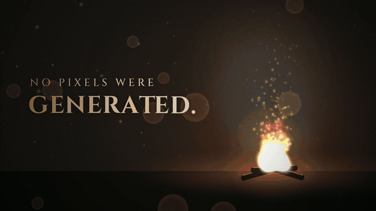
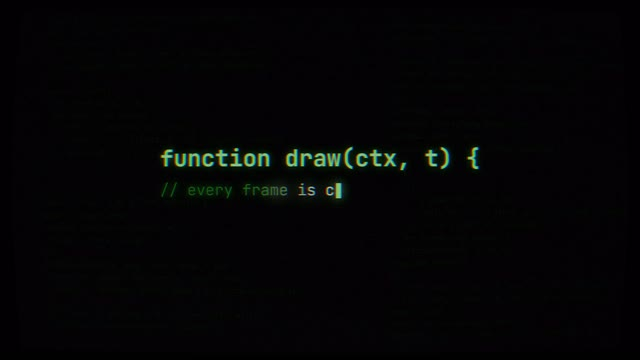
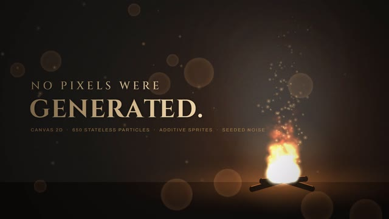
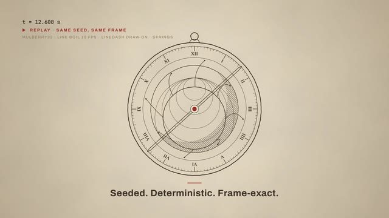
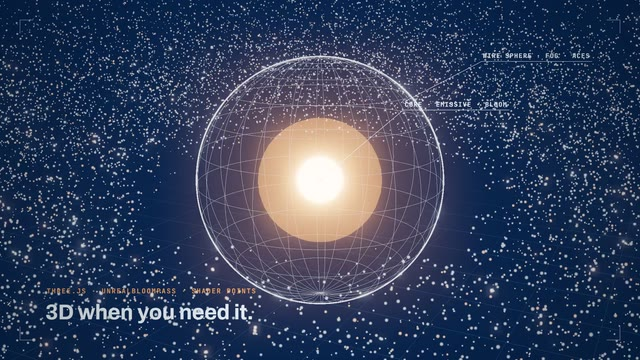
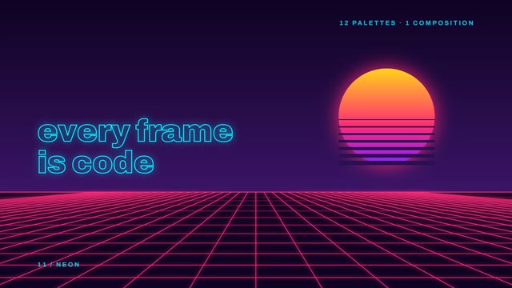
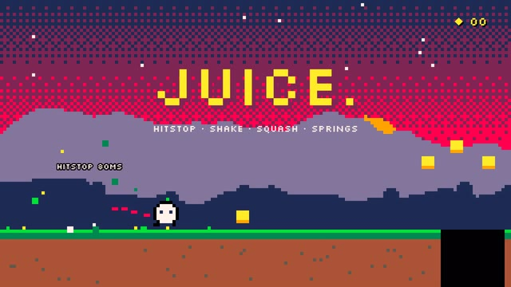
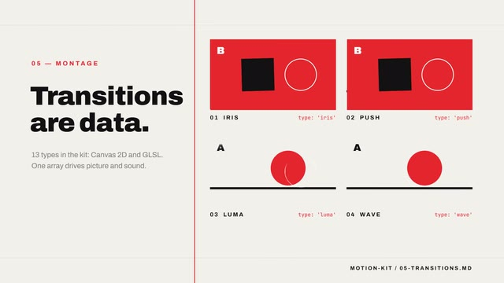
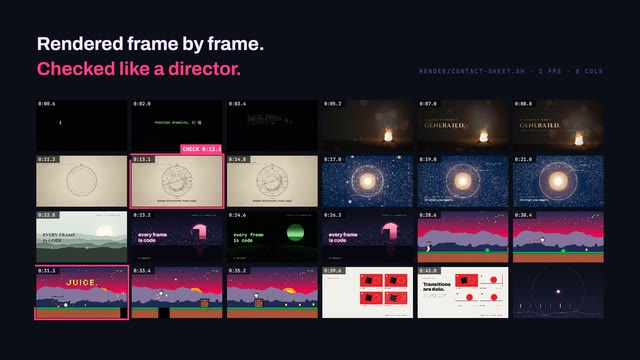
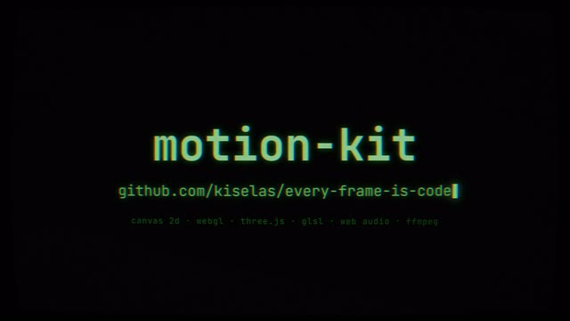

<div align="center">

# motion-kit

**Every frame is code.** Набор знаний, по которому AI-агент делает графику кодом:<br>
ролики, эксплейнеры, кинетическую типографику, 3D-сцены и игры, а потом сам рендерит их в MP4.



<sub>Ни одного сгенерированного пикселя: весь ролик — один HTML-файл, который рисует каждый кадр.<br>
Исходник: <a href="examples/demo/demo.html">examples/demo/demo.html</a> · сценарий: <a href="examples/demo/SCRIPT.md">examples/demo/SCRIPT.md</a></sub>

[](LICENSE)
[](SKILL.md)


</div>

## Зачем это

Модель умеет писать код графики, но без правил выдаёт один и тот же скринсейвер: тёмно-синий фон, неоновый градиент, частицы «для красоты», всё движется линейно и одновременно, текст налезает на объекты, переходы только кроссфейдом.

motion-kit — это правила и рецепты, которые закрывают эти провалы. Главная идея архитектуры: **кадр — чистая функция времени** `draw(ctx, t)`. Отсюда всё остальное:

- **перемотка на любую секунду** — кадр не зависит от предыдущих;
- **покадровый рендер без рывков** — headless Chrome ждёт каждый кадр, сколько бы тот ни рисовался;
- **правка одной строкой** — поменял easing или цвет, перерендерил, получил тот же ролик с одним отличием;
- **звук в синхроне с картинкой** — музыка на Web Audio читает тот же массив событий, что и отрисовка.

## Что внутри демо-ролика

Минутный ролик сделан строго по этому набору. Каждая сцена показывает одну возможность в своём стиле:

<table>
<tr>
<td width="33%"><br><b>Печать и частицы</b><br><sub>Текст печатается и рассыпается в частицы. <a href="08-kinetic-typography.md">08</a> · <a href="07-effects-cookbook.md">07</a></sub></td>
<td width="33%"><br><b>Огонь без состояния</b><br><sub>650 частиц, спрайты, аддитивное смешивание, зерно. <a href="07-effects-cookbook.md">07</a></sub></td>
<td width="33%"><br><b>Детерминизм</b><br><sub>Линия рисует астролябию, кадр перематывается и повторяется точь-в-точь. <a href="01-pipeline.md">01</a> · <a href="04-motion-easing.md">04</a></sub></td>
</tr>
<tr>
<td><br><b>3D, когда нужно</b><br><sub>Three.js, bloom, ACES, 20 000 частиц на шейдере. <a href="11-threejs.md">11</a></sub></td>
<td><br><b>12 стилей, одна композиция</b><br><sub>Монтаж на бит с ускорением к пику. <a href="03-visual-style.md">03</a> · <a href="06-montage.md">06</a></sub></td>
<td><br><b>Game feel</b><br><sub>Hitstop, тряска, squash &amp; stretch, speed ramp. <a href="10-games-juice.md">10</a></sub></td>
</tr>
<tr>
<td><br><b>Переходы — это данные</b><br><sub>Iris, push, luma, волна, прожиг, whip pan. <a href="05-transitions.md">05</a></sub></td>
<td><br><b>Проверка как у режиссёра</b><br><sub>Контакт-лист и правки по таймкодам. <a href="12-render-qa.md">12</a> · <a href="09-audio-sync.md">09</a></sub></td>
<td><br><b>CRT-финал</b><br><sub>Шейдерная постобработка: дисторсия, сканлайны, аберрация. <a href="07-effects-cookbook.md">07</a></sub></td>
</tr>
</table>

Посмотреть вживую: открой [`examples/demo/demo.html`](examples/demo/demo.html) в Chrome. Клик включает звук, пробел ставит на паузу, стрелки перематывают.

## Быстрый старт

**Как скилл Claude Code** (рекомендуется):

```bash
git clone https://github.com/kiselas/every-frame-is-code ~/.claude/skills/motion-kit
```

Claude Code подхватит `SKILL.md` и сам прочитает нужные файлы, когда задача про графику или анимацию. Попробуй:

```
Сделай 20-секундный ролик про историю часов в стиле гравюры, 1080p, с музыкой.
Сначала покажи план как данные, потом код, потом отрендери и посмотри контакт-лист.
```

**Как документация в проекте.** Скопируй папку в `docs/motion/` и добавь в `CLAUDE.md`:

```
Перед любой работой с графикой, анимацией или играми прочитай docs/motion/00-agent-brief.md,
затем файлы, относящиеся к задаче.
```

**В чате.** Прикрепи `00-agent-brief.md` и один-два тематических файла.

## Рендер

```bash
cd render && npm install
node render.mjs ../film.html ../film.mp4              # весь ролик со звуком
node render.mjs ../film.html ../part.mp4 --from 20 --to 35
./contact-sheet.sh ../film.mp4 ../sheet.png           # 2 кадра в секунду на одной картинке
```

Нужны Node 18+, Google Chrome и ffmpeg. Страница должна выставить `window.__meta`, `window.__draw(t)` и `window.__ready`, подробно в [01-pipeline.md](01-pipeline.md) и [render/README.md](render/README.md).

Демо-ролик целиком (1080p, 60 fps, со звуком):

```bash
node render.mjs ../examples/demo/demo.html ../examples/demo/demo.mp4
```

## Содержание

| Файл | О чём |
|---|---|
| [00-agent-brief.md](00-agent-brief.md) | Сжатые правила для агента. Главный файл |
| [01-pipeline.md](01-pipeline.md) | Архитектура: draw(t), таймлайн сцен, детерминизм, буферы |
| [02-prompting.md](02-prompting.md) | Как ставить задачу, шаблоны промптов, фразы для правок |
| [03-visual-style.md](03-visual-style.md) | Палитры, свет, композиция, фактура, цветокоррекция |
| [04-motion-easing.md](04-motion-easing.md) | Кривые, пружины, тайминг, принципы анимации, камера |
| [05-transitions.md](05-transitions.md) | Каталог переходов: Canvas 2D и GLSL |
| [06-montage.md](06-montage.md) | Монтаж: склейки, ритм, структура, speed ramp |
| [07-effects-cookbook.md](07-effects-cookbook.md) | Шум, частицы, огонь, дым, свечение, зерно, шейдеры |
| [08-kinetic-typography.md](08-kinetic-typography.md) | Анимированный текст и титры под озвучку |
| [09-audio-sync.md](09-audio-sync.md) | Музыка на Web Audio, офлайн-рендер, озвучка, микс |
| [10-games-juice.md](10-games-juice.md) | Game feel: управление, хитстоп, тряска, камера |
| [11-threejs.md](11-threejs.md) | 3D: свет, постобработка, частицы на шейдерах |
| [12-render-qa.md](12-render-qa.md) | Рендер, контакт-листы, чек-лист проверки |
| [render/](render/) | Скрипты рендера (Node + Playwright + ffmpeg) |
| [examples/demo/](examples/demo/) | Демо-ролик: сценарий и исходник |
| [sources.md](sources.md) | Источники и что почитать |

## Вклад

Pull requests приветствуются: новые рецепты эффектов, переходы, промпты, которые у вас сработали (с результатом), исправления в коде. К промпту прикладывайте ссылку на ролик или контакт-лист.

## Лицензия

MIT
