<div align="center">

# motion-kit

**Every frame is code.** A knowledge kit that lets an AI agent make graphics with code:<br>
videos, explainers, kinetic typography, 3D scenes, pixel-art films and games, and then render them to MP4 on its own.

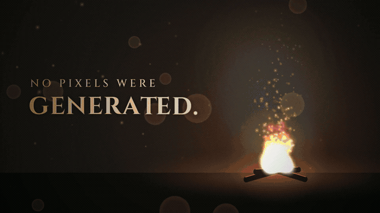

<sub>Not a single generated pixel: the whole film is one HTML file that draws every frame.<br>
<b><a href="https://kiselas.github.io/every-frame-is-code/">▶ Watch it live in your browser</a></b> · source: <a href="examples/demo/demo.html">examples/demo/demo.html</a> · script: <a href="examples/demo/SCRIPT.md">examples/demo/SCRIPT.md</a></sub>

[](LICENSE)
[](SKILL.md)


</div>

## Why

Models can write graphics code, but without rules they produce the same screensaver every time: a dark navy background, a neon gradient, particles "for atmosphere", everything moving linearly and all at once, text on top of objects, and crossfades as the only transition.

motion-kit is a set of rules and recipes that closes those gaps. The core architectural idea: **a frame is a pure function of time**, `draw(ctx, t)`. Everything else follows from it:

- **seek to any second**: a frame does not depend on the previous ones;
- **frame-by-frame rendering without stutter**: headless Chrome waits for every frame, however long it takes to draw;
- **one-line edits**: change an easing curve or a color, re-render, and get the same film with exactly one difference;
- **sound in sync with the picture**: the Web Audio score reads the same event list as the drawing code.

## What's in the demo film

The one-minute film was made strictly by this kit. Each scene shows one capability in its own style:

<table>
<tr>
<td width="33%">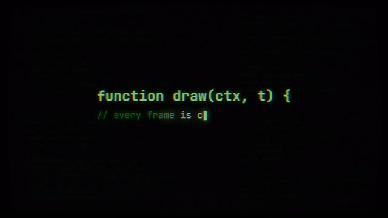<br><b>Typing and particles</b><br><sub>Text types itself out, then scatters into particles. <a href="08-kinetic-typography.md">08</a> · <a href="07-effects-cookbook.md">07</a></sub></td>
<td width="33%">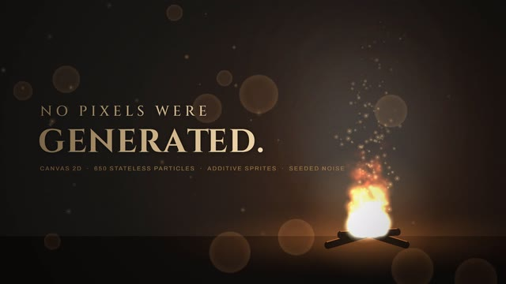<br><b>Stateless fire</b><br><sub>650 particles, sprites, additive blending, film grain. <a href="07-effects-cookbook.md">07</a></sub></td>
<td width="33%">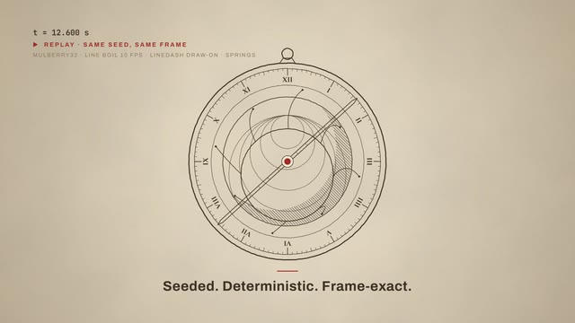<br><b>Determinism</b><br><sub>A line draws an astrolabe, the frame rewinds and replays exactly. <a href="01-pipeline.md">01</a> · <a href="04-motion-easing.md">04</a></sub></td>
</tr>
<tr>
<td>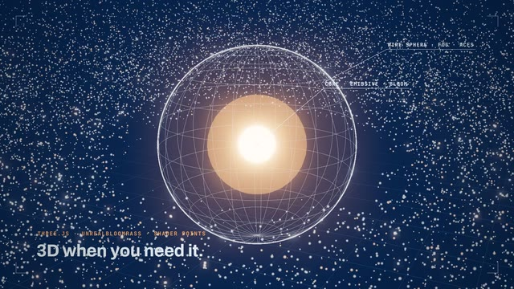<br><b>3D when you need it</b><br><sub>Three.js, bloom, ACES, 20,000 shader particles. <a href="11-threejs.md">11</a></sub></td>
<td>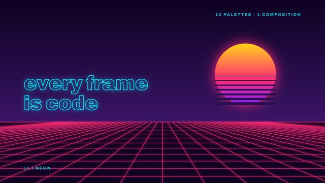<br><b>12 styles, one composition</b><br><sub>Cuts on the beat, accelerating toward the peak. <a href="03-visual-style.md">03</a> · <a href="06-montage.md">06</a></sub></td>
<td>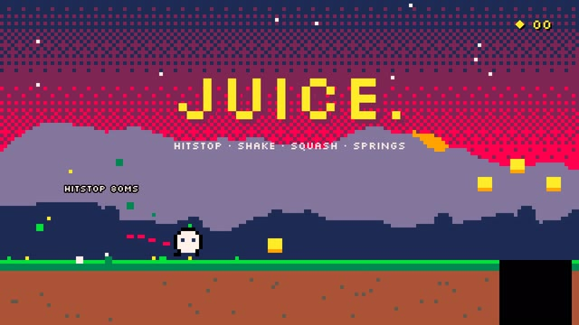<br><b>Game feel</b><br><sub>Hitstop, screen shake, squash &amp; stretch, speed ramp. <a href="10-games-juice.md">10</a></sub></td>
</tr>
<tr>
<td>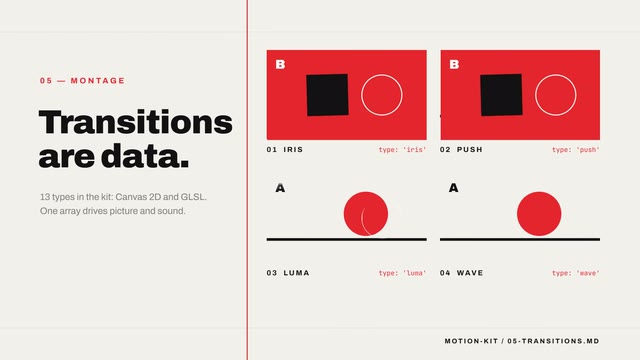<br><b>Transitions are data</b><br><sub>Iris, push, luma, wave, burn, whip pan. <a href="05-transitions.md">05</a></sub></td>
<td>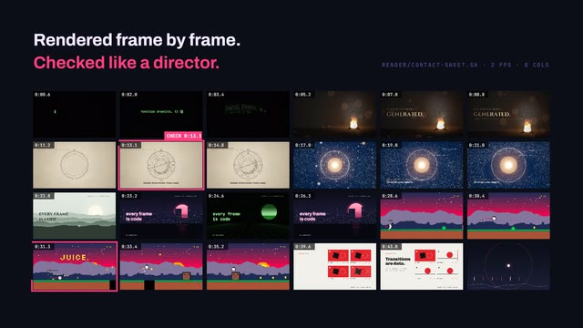<br><b>Checked like a director</b><br><sub>A contact sheet and fixes by timecode. <a href="12-render-qa.md">12</a> · <a href="09-audio-sync.md">09</a></sub></td>
<td>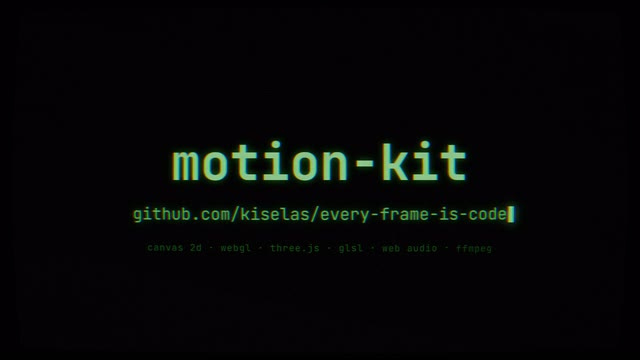<br><b>CRT finale</b><br><sub>Shader post-processing: distortion, scanlines, aberration. <a href="07-effects-cookbook.md">07</a></sub></td>
</tr>
</table>

Watch it live at [kiselas.github.io/every-frame-is-code](https://kiselas.github.io/every-frame-is-code/): the page draws every frame in your browser as you watch. Or open [`examples/demo/demo.html`](examples/demo/demo.html) locally in Chrome. Click to turn on sound, space pauses, arrow keys seek.

## Films of 1-3 minutes

Long films need more than good frames: a question, a through-line, chapters, callbacks, and a way to make 20-70 shots feel like one film. [14-long-form.md](14-long-form.md) is the method; [runtime/film.js](runtime/) is the machinery every long film needs (a tempo map, shots measured in bars, transitions, a HUD that carries state, statement text, counters, themes, line art and a globe, a score on the same clock, a live preview). The worked example, [examples/gps/](examples/gps/), is a 90-second explainer on how GPS finds you, in five chapters, with the error of your position as the through-line.

**[▶ Watch Four Clocks live in your browser](https://kiselas.github.io/every-frame-is-code/gps/)** · source: [examples/gps/film.html](examples/gps/film.html) · script and sources: [examples/gps/SCRIPT.md](examples/gps/SCRIPT.md)

To learn from someone else's film: `node render/analyze.mjs reference.mp4 out/` writes a report on its shots, pace, tempo and cuts, with contact sheets.

## Vertical video

Reels, Shorts and TikTok are a different screen: 9:16, the platform's own interface over the edges, a hook in the first second, text read at arm's length. [19-vertical.md](19-vertical.md) is the frame (safe zones, three bands, type, fonts for Cyrillic and other non-Latin scripts, tools), [20-silent-social.md](20-silent-social.md) is the film (the contract with a viewer who has the sound off, the word budget, eleven genres and what each demands), [21-infographics.md](21-infographics.md) is the picture (how a diagram proves a claim instead of decorating it), and `runtime/film.js` switches to portrait defaults when `H > W`. The worked example, [examples/lyapunov/](examples/lyapunov/), is a 50-second film in Russian about the mathematician Alexey Lyapunov: a rubber stamp that lands, a flowchart that runs, a program that assembles itself, a stamp that is struck out.

<div align="center">
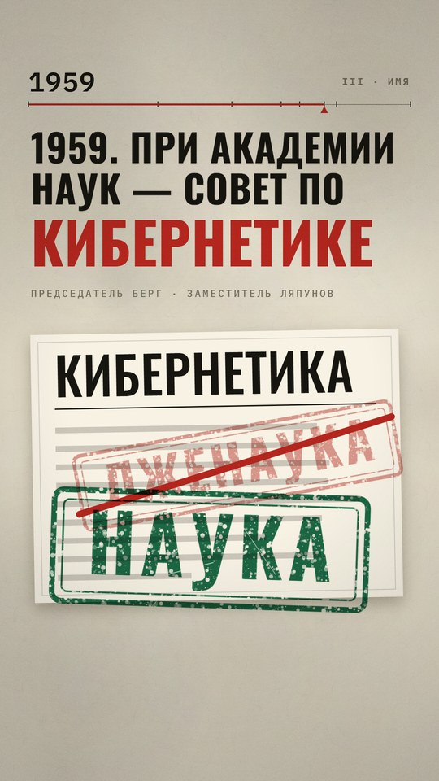
</div>

Spec: [examples/lyapunov/spec.json](examples/lyapunov/spec.json) (voiced, version 2) · script, facts and sources: [examples/lyapunov/SCRIPT.md](examples/lyapunov/SCRIPT.md) · the silent first version, a [live page](https://kiselas.github.io/every-frame-is-code/lyapunov/): [v1/](examples/lyapunov/v1/)

For a series, [23-short-factory.md](23-short-factory.md) is the line: a voiced, subtitled short is described by one `spec.json` (a voice text, shots tied to the spoken words, picture blocks, a music plan, facts with sources), and `node render/make.mjs spec.json` lints it, synthesizes the voice (free Edge TTS or OpenRouter), builds the film, renders it, reviews it against the rules above and writes the captions, the cover and the post text.

## Pixel and retro

A limit is a style. 160×90 pixels, 16 colors and four sound channels take away the defaults a model reaches for (gradients, glow, navy and amber) and leave what it does well: composition, timing, shapes. The pixel toolkit borrows the best ideas of [Pyxel](https://github.com/kitao/pyxel), PICO-8 and the demoscene and rebuilds them around `draw(t)`:

<div align="center">
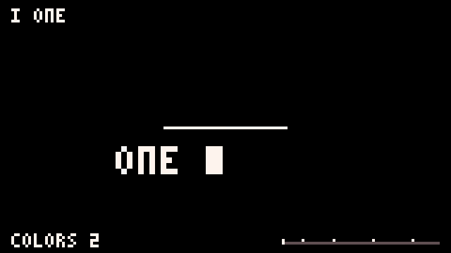
</div>

**[▶ Watch Sixteen Colors live in your browser](https://kiselas.github.io/every-frame-is-code/pixel/)** · source: [examples/pixel/film.html](examples/pixel/film.html) · script: [examples/pixel/SCRIPT.md](examples/pixel/SCRIPT.md)

| | What you get | Read |
|---|---|---|
| **Pixel screen** | an indexed-color framebuffer: `pal`, `dither(alpha)`, `clip`, `camera`, sprites written as text, a 3×5 font, a Mode 7 perspective floor with billboards. Palette maps fade, flash and cycle a whole picture without redrawing | [15-pixel-retro.md](15-pixel-retro.md) · [runtime/pixel.js](runtime/pixel.js) |
| **Post pass** | any canvas, a Three.js scene included, shrunk and snapped to a palette with an ordered Bayer dither on the GPU: the *Obra Dinn* look, stateless | [15-pixel-retro.md](15-pixel-retro.md) |
| **Dithered transitions** | `bayer`, `bayerwipe`, `pixelate`, `squares`, drop-in for `Film.create({ transitions })` | [15-pixel-retro.md](15-pixel-retro.md) |
| **Chiptune from text** | a whole score as a short MML string on four channels, plus 8-bit sound effect presets, on the film's tempo map | [16-chiptune.md](16-chiptune.md) · [runtime/chip.js](runtime/chip.js) |
| **Demoscene effects** | plasma, tunnel, rotozoom, copper bars, metaballs, starfield, a stateless fire and more: a formula of (x, y, t) through a palette ramp | [17-demoscene.md](17-demoscene.md) · [runtime/pixel-fx.js](runtime/pixel-fx.js) |

<table>
<tr>
<td width="33%">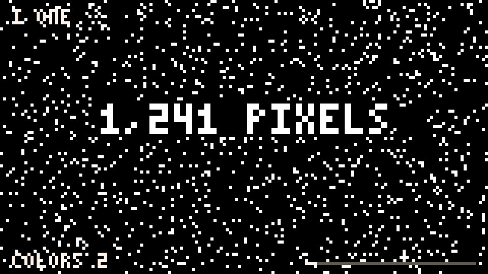<br><b>One pixel, one screen</b><br><sub>A counter runs 1 to 14,400 while the screen lights up.</sub></td>
<td width="33%">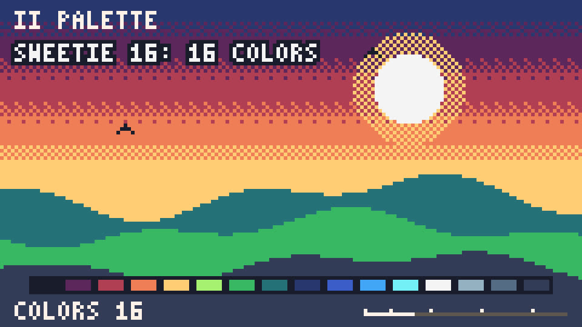<br><b>One drawing, many palettes</b><br><sub>Indexes, not colors: Game Boy, CGA, then 16 colors.</sub></td>
<td width="33%">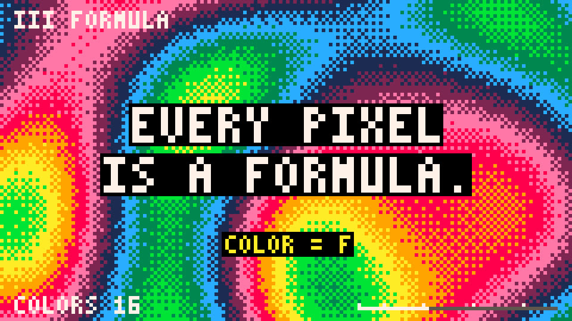<br><b>Every pixel is a formula</b><br><sub>Stateless effects: seek anywhere.</sub></td>
</tr>
<tr>
<td>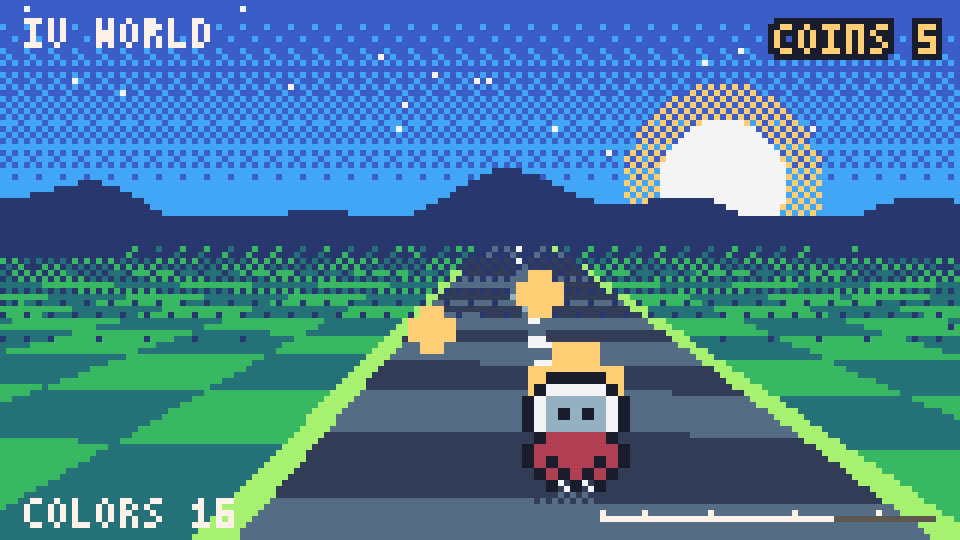<br><b>Sprites are text</b><br><sub>A hero from a grid of characters on a Mode 7 road.</sub></td>
<td>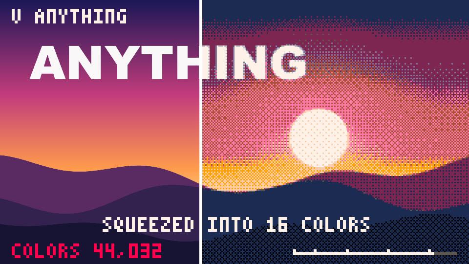<br><b>Squeeze anything</b><br><sub>The post pass turns 16.7 million colors into 16.</sub></td>
<td>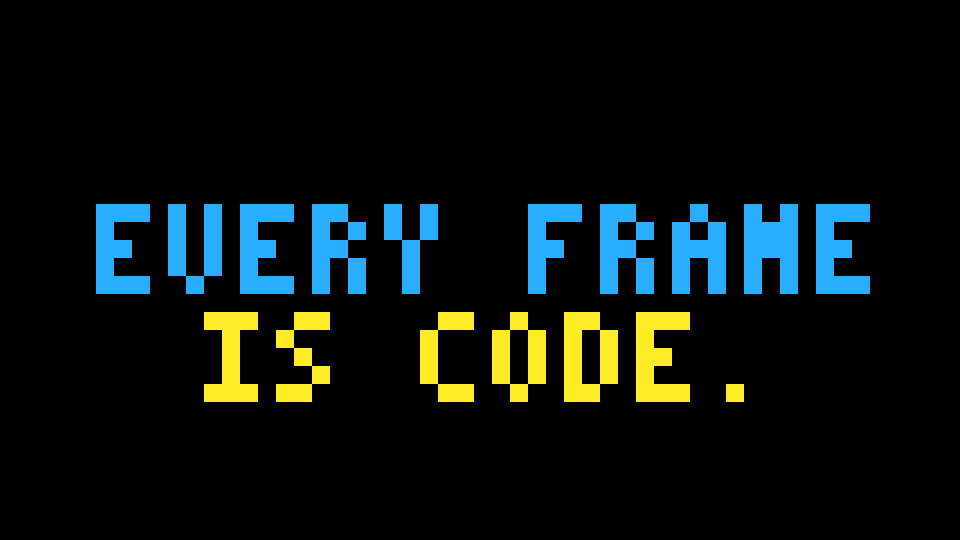<br><b>The callback</b><br><sub>Back to one pixel, with the three limits typed under it.</sub></td>
</tr>
</table>

## Quick start

motion-kit is packaged as a skill in the open [Agent Skills](https://agentskills.io) format: a folder with a `SKILL.md`. The same skill works in Claude and in ChatGPT; only the install location differs.

| Where | How to install |
|---|---|
| **Claude Code** | `git clone https://github.com/kiselas/every-frame-is-code ~/.claude/skills/motion-kit` |
| **Codex** (CLI, IDE, app) | `git clone https://github.com/kiselas/every-frame-is-code ~/.agents/skills/motion-kit` |
| **ChatGPT** | download [motion-kit.zip](https://github.com/kiselas/every-frame-is-code/releases/latest/download/motion-kit.zip), then Plugins → Skills → Create → Upload from computer |
| **Claude.ai / Claude Desktop** | the same [motion-kit.zip](https://github.com/kiselas/every-frame-is-code/releases/latest/download/motion-kit.zip), then Customize → Skills → Upload |

For a single project, clone into `.claude/skills/motion-kit` or `.agents/skills/motion-kit` inside the repository. The agent picks up the skill on its own when the task is about graphics or animation. To call it explicitly: `/motion-kit` in Claude Code, `$motion-kit` in Codex, `@motion-kit` in ChatGPT. Try:

```
Make a 20-second film about the history of clocks in an engraving style, 1080p, with music.
Show the plan as data first, then the code, then render it and review the contact sheet.
```

Rendering to MP4 needs Node, Chrome and ffmpeg, so it works where the agent has a terminal: Claude Code and Codex. In ChatGPT and Claude.ai the skill helps plan and write the film, and you render it locally with the command below.

**Without skill support.** Copy the folder to `docs/motion/` and add this to `CLAUDE.md` or `AGENTS.md`:

```
Before any work on graphics, animation or games, read docs/motion/00-agent-brief.md,
then the files relevant to the task.
```

In a plain chat, attach `00-agent-brief.md` and one or two topic files.

## Rendering

```bash
cd render && npm install
node render.mjs ../film.html ../film.mp4              # the whole film with sound
node render.mjs ../film.html ../part.mp4 --from 20 --to 35 --draft   # quick preview of a fragment
node render.mjs ../film.html ../film.mp4 --profile    # where the time goes, by timecode
./contact-sheet.sh ../film.mp4 ../sheet.png           # 2 frames per second on one image
```

Frames are captured over CDP and rendered by several browsers in parallel: the 60 s demo renders in about 3 minutes on a laptop, and a draft of a fragment in seconds. What makes a page fast or slow to render is measured in [13-performance.md](13-performance.md).

Requires Node 18+, Google Chrome and ffmpeg. The page must expose `window.__meta`, `window.__draw(t)` and `window.__ready`; details in [01-pipeline.md](01-pipeline.md) and [render/README.md](render/README.md).

The full demo film (1080p, 60 fps, with sound):

```bash
node render.mjs ../examples/demo/demo.html ../examples/demo/demo.mp4
```

## Contents

| File | About |
|---|---|
| [00-agent-brief.md](00-agent-brief.md) | Condensed rules for the agent. The main file |
| [01-pipeline.md](01-pipeline.md) | Architecture: draw(t), scene timeline, determinism, buffers |
| [02-prompting.md](02-prompting.md) | How to brief a task, prompt templates, phrases for revisions |
| [03-visual-style.md](03-visual-style.md) | Palettes, light, composition, texture, color grading |
| [04-motion-easing.md](04-motion-easing.md) | Curves, springs, timing, animation principles, camera |
| [05-transitions.md](05-transitions.md) | Transition catalog: Canvas 2D and GLSL |
| [06-montage.md](06-montage.md) | Editing: cuts, rhythm, structure, speed ramp |
| [07-effects-cookbook.md](07-effects-cookbook.md) | Noise, particles, fire, smoke, glow, grain, shaders |
| [08-kinetic-typography.md](08-kinetic-typography.md) | Animated text and captions for voice-over |
| [09-audio-sync.md](09-audio-sync.md) | Music with Web Audio, offline rendering, voice-over, mixing |
| [10-games-juice.md](10-games-juice.md) | Game feel: controls, hitstop, screen shake, camera |
| [11-threejs.md](11-threejs.md) | 3D: lighting, post-processing, shader particles |
| [12-render-qa.md](12-render-qa.md) | Rendering, contact sheets, review checklist |
| [13-performance.md](13-performance.md) | Fast pages and fast renders: measured costs of canvas operations, render pipeline, profiling |
| [14-long-form.md](14-long-form.md) | Films of 1-3 minutes: thesis, spine, through-line, statements, chapters, callbacks, script as data |
| [15-pixel-retro.md](15-pixel-retro.md) | Pixel art and retro looks: fixed palettes, dithering, sprites as text, Mode 7, the palette post pass, dithered transitions |
| [16-chiptune.md](16-chiptune.md) | A score as text: MML on four channels, 8-bit sound effects, synced to the film's tempo map |
| [17-demoscene.md](17-demoscene.md) | Per-pixel effects as functions of (x, y, t): plasma, tunnel, rotozoom, copper bars, fire and more |
| [18-music-generation.md](18-music-generation.md) | A score from a plan: key, style and an energy per section become chords, bass, hook, groove and fills; a linter and an audio report for music you cannot hear |
| [19-vertical.md](19-vertical.md) | Vertical video for Reels, Shorts and TikTok: 1080×1920, safe zones, type, non-Latin fonts, text-fit checks, review |
| [20-silent-social.md](20-silent-social.md) | Silent social video: the contract with a muted viewer, the word budget, eleven genres (how it works, one life, one number, timeline, versus, myth vs fact, countdown, process, statement, teaser, loop) and their requirements |
| [21-infographics.md](21-infographics.md) | Infographics in motion: claim types, the label test, encodings people read accurately, yardsticks, motion as data, density limits for a phone, a worked critique |
| [22-electronic-music.md](22-electronic-music.md) | Electronic music for a film without hunting for a licensed track: a local open-source model (ACE-Step 1.5, MIT) makes house, techno, lo-fi, synthwave and more at the film's tempo, a prompt library, a tempo fit and a grid check for music you cannot hear; Strudel patterns as a fallback; a list of what to use and what to avoid, with licences |
| [23-short-factory.md](23-short-factory.md) | A line for voiced vertical shorts: one `spec.json` per video, picture blocks, anchors on spoken words, and the tools that lint, voice, build, render, review and package it |
| [runtime/](runtime/) | `film.js`: the runtime for long films, `pixel.js`, `pixel-fx.js`, `chip.js`, `compose.js` and `music-lint.js` for pixel, retro and generated music, and `inline.mjs` to fold a film into one file |
| [render/](render/) | Render, contact sheets, stills, reference breakdown, beat maps (Node + Playwright + ffmpeg) |
| [examples/demo/](examples/demo/) | Demo film: script and source |
| [examples/gps/](examples/gps/) | Four Clocks: a 90 s explainer built on the runtime, with its script and sources |
| [examples/pixel/](examples/pixel/) | Sixteen Colors: a 64 s pixel film that uses the whole pixel toolkit, with its script |
| [examples/lyapunov/](examples/lyapunov/) | Lyapunov: a 60 s voiced vertical short for Reels and Shorts (in Russian) built from one `spec.json`, with its script, facts and sources; `v1/` is the silent hand-drawn first version |
| [scripts/pack-skill.sh](scripts/pack-skill.sh) | Builds `motion-kit.zip` for ChatGPT and Claude.ai. Releases build it automatically: just push a `vX.Y.Z` tag |
| [sources.md](sources.md) | Sources and further reading |

## Contributing

Pull requests are welcome: new effect recipes, transitions, prompts that worked for you (with the result), fixes to the code. When you submit a prompt, include a link to the video or its contact sheet.

## License

MIT
